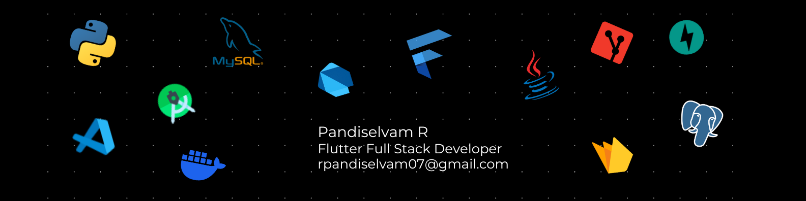

<!-- Trigger GitHub Actions -->

  

<h1 align="center">👋 Hi, I'm Pandi Selvam</h1>
<h3 align="center">Flutter Developer</h3>

  <a href="mailto:rpandiselvam07@gmail.com">📧 Email</a> •
  <a href="https://www.linkedin.com/in/pandiselvam-r-316928250/">💼 LinkedIn</a> •
  <a href="https://pandiselvam-portfolio.web.app/">🌐 Portfolio</a> •
  <a href="https://www.instagram.com/pandi_selvam_07/">📸 Instagram</a>

---

🚀 I'm a **Flutter Full Stack Developer** who loves turning ideas into real-world apps — fast, clean, and beautifully designed.

- 💻 I build cross-platform solutions for **Mobile, Web, and Windows desktop** using Flutter.
- 🔥 My backend expertise includes **Firebase**, **FastAPI**, and **PostgreSQL**, giving me full control from UI to database.
- 🛠 I follow clean architecture with **Riverpod**, **MVVM**, and reactive patterns for real-time, scalable apps.
- 🧠 Currently exploring **Cloud Functions**, API security, and custom backend integrations.
- 💬 Reach me at: **rpandiselvam07@gmail.com**
- ⚡ Fun fact: I often build first, learn by doing, and improve through hands-on iteration 🤓

> 💡 Got an idea? I’d love to hear what you want to build!

---

### 🧰 Tech Stack

  
  
  
   
  
  
  
   
  
   
  
  

---

### 📫 Let's Connect

  
  
  
  

